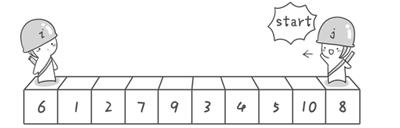
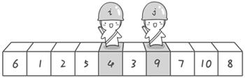
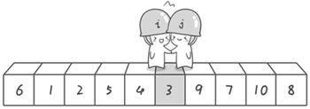

# 2019新春面试题专题（上）

### 个人介绍

姓名：钟益

昵称：子鼠

标签：可吃可玩

特点：老而不柴，肥而不腻

经历：08年入行，5年专职后端，13年转前端至今，期间专职、兼职讲师5年+

------

### 面试专题

通过收集整理各大公司(包括知名一线大厂)的面试题，我们可以把知识点涉及面进行一个分类：

- 语法基础
- dom、事件应用原理
- 前后端数据交互(网络协议)
- 框架应用于原理
- 数据处理，基础算法

基础并不意味着简单，越是基础的东西，实际工作中的运用就越广泛，无论是原生 js 开发，还是基于框架的应用开发都离不开这些基础。

为了能给更加深入的理解这些面试题中的知识点，我们通过各种实际应用例子来讲解和演示它们，这样记忆更加深刻！

- 数据驱动思想
- 递归
- 数组扁平化
- 排序算法
- 去重
- 迭代原理

------

### 课前准备

- ECMAScript
- 些许 DOM

------

### 知识点参考

本次分享内容涉及知识点皆可参考《JavaScript 高级工程师》课程

课程地址：https://www.kaikeba.com/vipcourse/js

------

### 交流咨询

课程咨询问题

##### 加群

##### 咨询课程顾问（小师妹）

------

### 数据渲染

###### 简单遍历
- Array.prototype.forEach() : es5.1 added

##### 封装
- Array.prototype.map() : es5.1 added
- 箭头函数

问题：对多维度数据无法进行处理

------

### 无限级展示 

##### 递归

函数自己调用自己

`注意：递归也是一种循环，注意循环条件的处理，避免出现非必要的无限循环`

- Array.isArray() : es5.1 added
- 函数参数默认值
- Array.prototype.fill() : es2015 / es6 added

------

### 数组扁平化（降维）

问题：现有数据结构不利于数据检索

- Array.prototype.flat() : proposal - Finished (4)
- Array.prototype.reduce() : es5.1 added

------

### 排序

- Array.prototype.sort() : es1 added

##### 排序算法

- 冒泡排序
- 快速排序

一、

二、

三、

四、

五、

六、

七、

八、

九、

------

### 数组去重

##### 简单值去重

- Object.keys() : es5.1 added
- Set : es2015 / es6 added

##### 特殊条件去重

##### 复杂值去重

------

### 对象遍历

##### for…in

- Object.defineProperty()
- 对象属性描述符
  - configurable
  - enumerable
  - 数据描述符
    - value
    - writable
  - 存取描述符
    - get
    - set

------

### 迭代器&迭代协议

##### for…of

可迭代协议

​	定义了一个对象可被迭代的规则：实现一个名为 `Symbol.iterator` 的方法，也称为：`迭代器`

迭代器

​	Symbol.iterator 属性

迭代器协议

 - 迭代器是返回一个包含了 next 方法的对象
 - next 方法返回一个包含 `done` 和 `value` 的对象
    - done 是一个 boolean 值
       - true 表示迭代结束，此时忽略 value
       - false 表示可继续迭代
    - value 是一个任意类型的值，也就是迭代过程中的值

------

### 下节课预告

主题：2019新春面试题专题 - 移动端

时间：2019年04月03日（周三）

